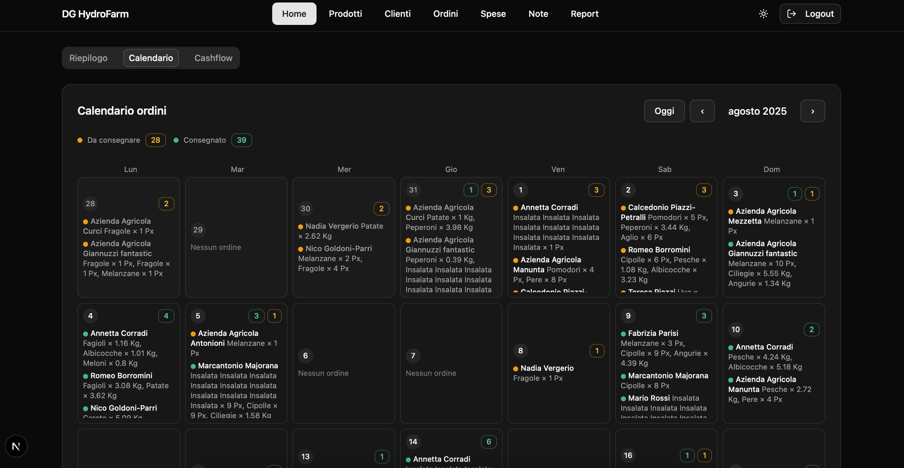
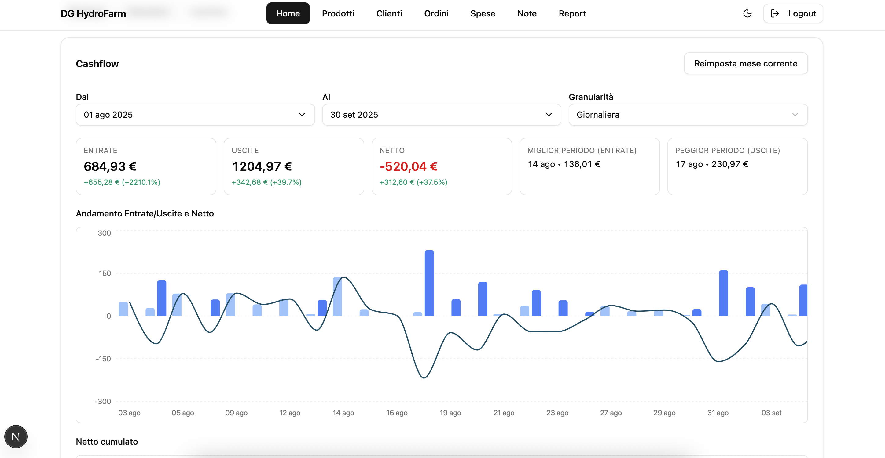
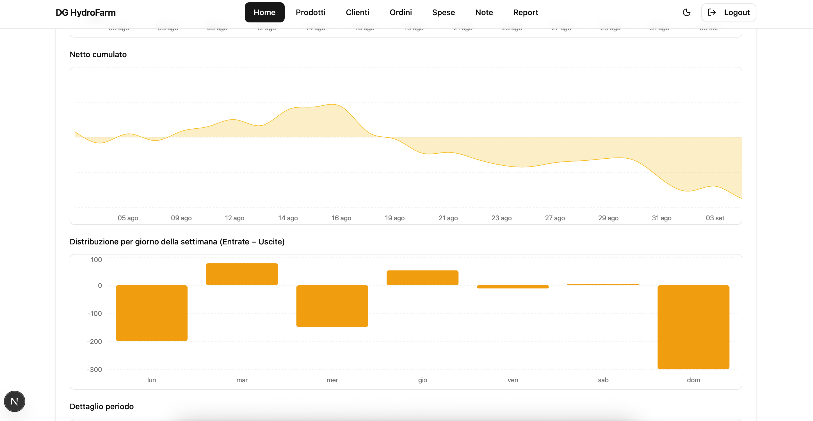
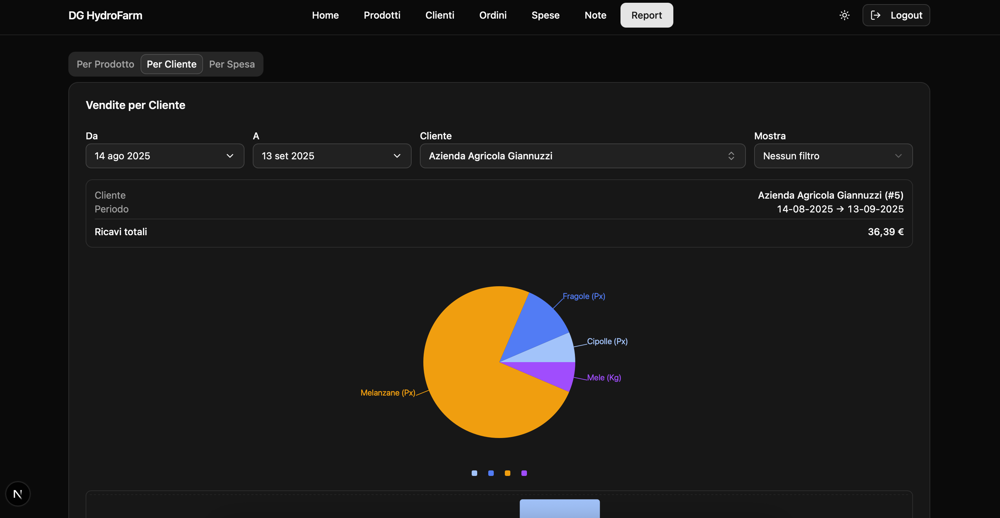
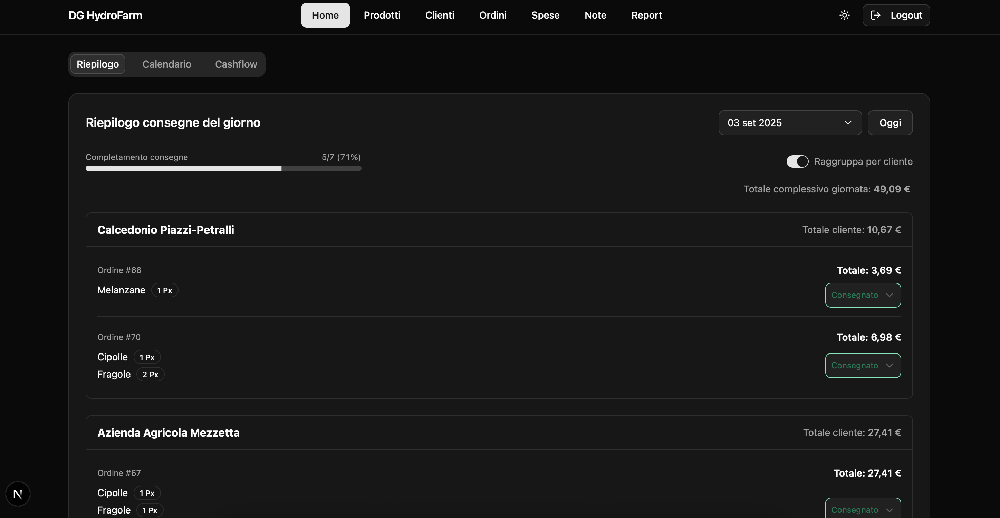
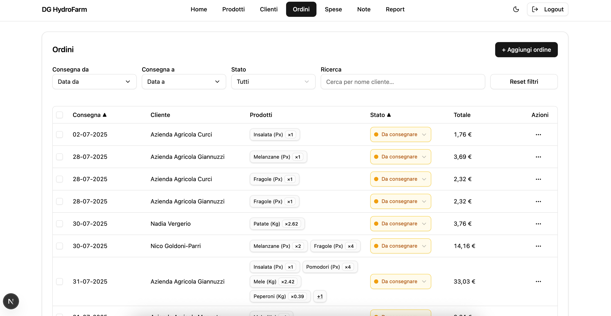

# Orders Tracker

Orders Tracker è un’applicazione full-stack per la gestione e il monitoraggio degli ordini, composta da:

* **Frontend**: Next.js (React)
* **Backend**: FastAPI (Python)
* **Database**: MySQL
* **Reverse Proxy**: Nginx
* **Backup**: Restic con supporto S3

## 📸 Screenshot

<p align="center">
  
  
</p>

<p align="center">
  
  
</p>

<p align="center">
  
  
</p>

---

## Requisiti

* Docker e Docker Compose installati sul VPS
* Un file `.env` nella root del progetto con tutte le variabili necessarie (app, database, backup, sicurezza)

---

## Struttura

```
.
├── backend/         # API FastAPI
├── frontend/        # App Next.js
├── nginx/           # Configurazione reverse proxy
├── database/        # Dati persistenti MySQL
├── docker-compose.yml
└── .env             # Variabili di ambiente
```

---

## Deploy

### Ambiente di sviluppo (solo HTTP, accesso via IP)

```bash
COMPOSE_PROFILES=dev
docker compose up -d
```

Visita:

* Frontend → `http://<IP_VPS>/`
* Backend health → `http://<IP_VPS>/api/health`

### Produzione (HTTPS + dominio)

```bash
COMPOSE_PROFILES=prod
docker compose up -d
```

Visita:

* Frontend → `https://<DOMAIN>/`
* Backend health → `https://<DOMAIN>/api/health`

---

## Backup database

I backup automatici sono gestiti da Restic e inviati a un repository (locale o S3).
Esempio: listare gli snapshot disponibili

1. Inizializzazione del repository Restic (solo al primo deploy)

```bash
docker compose run --rm db_backup restic init
```

2. Esecuzione manuale del backup

```bash
docker compose run --rm db_backup restic snapshots
```

3. Ripristino del backup più recente in `/restore` (cartella creata automaticamente)

```bash
docker compose run --rm db_backup restic restore latest --target /restore
```

---

## Aggiornamenti

Per aggiornare codice e dipendenze:

```bash
git pull
docker compose build --no-cache
docker compose up -d
```